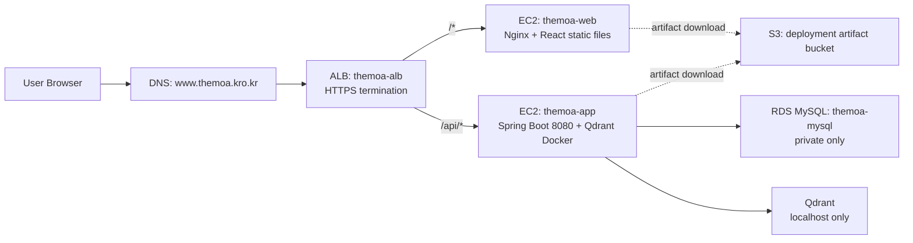

# The Moa (더모아)

**2030 사회초년생을 위한 맞춤형 자산 컨설팅 & 밀착 가이드 웹 서비스**

월급과 저축 목표를 입력하면 "오늘 당장 써도 되는 돈"을 역산해주고, 고정지출·지역 정책·금융상품까지 한 번에 챙겨주는 개인 맞춤형 자산 케어 플랫폼입니다.

- 서비스 주소: https://www.themoa.kro.kr
- 프론트엔드: React 19 + Vite ([frontend/](frontend/))
- 백엔드: Spring Boot 3.5 + Spring AI ([backend/](backend/))

## 목차

- [핵심 기능](#핵심-기능)
- [기술 스택](#기술-스택)
- [프로젝트 구조](#프로젝트-구조)
- [로컬 개발 환경](#로컬-개발-환경)
- [배포 아키텍처](#배포-아키텍처-aws)
- [CI/CD 파이프라인](#cicd-파이프라인)
- [Coding Agent 활용](#coding-agent-활용)
- [신경 써서 만든 부분](#신경-써서-만든-부분)

## 핵심 기능

### 1. 목표 중심 하루 소비 가이드 대시보드
월급/저축 목표를 입력하면 목표 달성을 위한 **하루 권장 소비량**을 역산하고, 현재 사용량 대비 그래프·프로그레스 바로 시각화합니다. 요일별 소비 패턴 분석, 전월 대비 지출 비교, 월 중반 이후 잔여일수 기준 예산 자동 재계산, AI 소비 코멘트("이번 달 식비가 지난달보다 23% 많아요")를 제공합니다.

### 2. 고정지출 관리 (SaaS/OTT 다이어트)
구독 서비스(넷플릭스, 유튜브 프리미엄, 통신비 등)를 이름·금액·결제일로 등록하면 이번 달 결제 타임라인을 캘린더로 보여주고, 고정비를 제외한 **순수 가용 자금**을 계산합니다. 자주 쓰는 서비스 프리셋과 "안 쓰는 구독 있지 않나요?" 같은 AI 코멘트를 지원합니다.

### 3. 지역 정책 & 복지 혜택 추천 (RAG)
거주지·나이·소득·직업군 기반으로 청년 지원 정책을 매칭하고, "경기도 사는데 받을 수 있는 청년 정책 있어?" 같은 자연어 질의에 응답합니다. 지원금액·신청기간·신청링크가 담긴 정책 카드 UI, 마감 임박 알림, 신청 완료 체크를 제공하며 **Qdrant + Spring AI 기반 RAG**로 동작합니다.

### 4. 금융상품 추천 (RAG)
온보딩 시 성향 진단 설문을 받고, "우대금리 조건 까다롭지 않은 적금 추천해줘" 같은 자연어 질의로 적금/예금/CMA/청년 특화 상품을 추천합니다. Top 3 비교 뷰와 저축 목표 연동 만기 수령액 시뮬레이션을 제공하며 이 역시 **Qdrant + Spring AI 기반 RAG**로 동작합니다.

### 5. 카드 연동 & 거래 내역 자동 수집
**CODEF API**로 카드사 커넥션을 맺어 실제 카드 거래 내역을 자동으로 가져오고, 가맹점·카테고리별로 분류해 소비 분석 데이터로 사용합니다.

### 6. 사용자 인증 & 온보딩
이메일 회원가입/로그인(JWT)과 소셜 로그인(OAuth2)을 지원하며, 기본정보 → 재정정보 → 성향진단 → 고정지출 등록 순서의 온보딩 플로우를 제공합니다.

### 7. AI 챗봇 어시스턴트
위 기능들을 하나의 채팅 UI로 통합해 멀티턴 대화(맥락 유지), 의도 분류를 통한 소비분석/정책/금융상품/고정지출 라우팅, 빠른 질문 버튼(Quick Reply), 월말 소비 리포트 자동 생성을 지원합니다.

### 관리자 기능
운영을 위한 관리자 화면도 별도로 구성되어 있습니다: 고객센터 문의 관리, 금융상품 데이터 관리, 가맹점 데이터 관리, 에러 로그 모니터링 등.

## 기술 스택

### Frontend
| 항목 | 내용 |
|---|---|
| 프레임워크 | React 19 + Vite |
| 라우팅 | react-router-dom |
| 상태관리 | Context API (별도 라이브러리 없이 React 내장 기능 사용) |
| HTTP 클라이언트 | axios (공통 인스턴스로 일원화) |
| 마크다운 렌더링 | marked + dompurify (AI 응답 렌더링용) |

### Backend
| 항목 | 내용 |
|---|---|
| 프레임워크 | Spring Boot 3.5, Java 17 |
| 인증 | Spring Security, JWT (jjwt), OAuth2 Client |
| DB | Spring Data JPA + MySQL |
| AI / RAG | Spring AI (OpenAI, Google GenAI/Gemini), Qdrant Vector Store |
| 외부 연동 | CODEF API (카드사 커넥션), 공공 청년정책 API |
| 문서화 | springdoc-openapi (Swagger UI) |
| 캐시 | Caffeine |
| 기타 | Spring Boot Actuator (API 응답시간 모니터링), Spring Mail |

### Infra
| 항목 | 내용 |
|---|---|
| 클라우드 | AWS (ALB, EC2, RDS MySQL, S3) |
| 웹서버 | Nginx (정적 파일 서빙) |
| 벡터 DB | Qdrant (Docker, EC2 내부 로컬 실행) |
| 로컬 개발 DB/벡터DB | docker-compose (MySQL 8.0, Qdrant) |
| CI/CD | GitHub Actions |

## 프로젝트 구조

```
themoa/
├── frontend/            # React + Vite SPA (기능 단위 구조, 상세는 frontend/README.md)
├── backend/             # Spring Boot API 서버 (도메인 단위 패키지 구조)
├── docker/              # 로컬 개발용 MySQL 초기화 스크립트 (gitignore, 로컬 전용)
├── docker-compose.yml   # 로컬 개발용 MySQL, Qdrant 컨테이너 (gitignore, 로컬 전용)
└── .github/workflows/   # CI/CD 파이프라인 정의
```

프론트엔드는 **기능(도메인) 단위 구조(feature-based)** 를 따르며, 화면 하나가 `features/` 아래 폴더 하나에 대응합니다. 자세한 규칙은 [frontend/README.md](frontend/README.md), [frontend/structure.md](frontend/structure.md)를 참고하세요.

백엔드는 `domain/<도메인명>/{controller,service,repository,entity,dto}` 형태의 도메인 단위 패키지 구조를 따릅니다 (auth, budget, calendar, cardconnection, cardtransaction, category, coaching, customerservice, financialsearch, fixedexpense, member, merchant, notification, policy, recommend, subscription 등).

## 로컬 개발 환경

```bash
# 1. 로컬 DB/벡터DB 실행 (MySQL, Qdrant)
docker compose up -d

# 2. 프론트엔드
cd frontend
cp .env.example .env
npm install
npm run dev

# 3. 백엔드
cd backend
./gradlew bootRun
```

## 배포 아키텍처 (AWS)



- 사용자는 `https://www.themoa.kro.kr` 단일 도메인으로 접속하고, ALB가 경로 기준(`/api/*` vs 그 외)으로 프론트/백엔드를 라우팅합니다. 같은 도메인에서 서빙되므로 **CORS 이슈가 없습니다.**
- `themoa-web`(Nginx, React 정적 파일), `themoa-app`(Spring Boot 8080 + Qdrant Docker) EC2는 모두 **private subnet**에 위치하며 public IP가 없습니다. 외부에서 접근 가능한 지점은 ALB 하나뿐입니다.
- RDS MySQL도 public access를 끄고 app EC2 보안그룹에서만 3306 포트 접근을 허용합니다.
- Qdrant는 별도 관리형 서비스 없이 app EC2 내부 Docker 컨테이너로 실행하며 `localhost`에만 바인딩합니다.
- 운영 서버 접속은 SSH(22번 포트)를 열지 않고 **AWS SSM Session Manager**를 사용합니다.
- 배포 산출물(`jar`, `dist.zip`)은 S3 버킷(public access 차단)에 업로드하고, EC2가 IAM Role로 다운로드합니다.

> VPC/서브넷/보안그룹/EC2/RDS/ALB 상세 스펙, 장애 대응 체크리스트, 정리 절차는 로컬 배포 설정 문서(`distributionSetting.md`, gitignore 대상이라 저장소에는 포함되지 않음)에 별도로 관리하고 있습니다.

## CI/CD 파이프라인

GitHub Actions로 `main` 브랜치에 변경된 경로에 따라 프론트/백엔드 배포가 독립적으로 트리거됩니다.

| 워크플로우 | 트리거 | 하는 일 |
|---|---|---|
| [deploy-frontend.yml](.github/workflows/deploy-frontend.yml) | `main` push, `frontend/**` 변경 | `npm ci` → `npm run build` → `dist` zip → S3 업로드 → SSM으로 web EC2에 배포 명령 전송 → Nginx reload → 헬스체크 |
| [deploy-backend.yml](.github/workflows/deploy-backend.yml) | `main` push, `backend/**` 변경 | `./gradlew bootJar -x test` → S3 업로드 → SSM으로 app EC2에 배포 명령 전송 → systemd 서비스 재시작 → 헬스체크 |
| [discord-pr-merge.yml](.github/workflows/discord-pr-merge.yml) | `dev` 브랜치 PR merge | PR 번호/제목/본문/링크를 Discord 웹훅으로 알림 |

배포 흐름 공통 패턴:

1. **OIDC 기반 AWS 인증** — 정적 AWS 액세스 키를 저장하지 않고 `aws-actions/configure-aws-credentials`가 GitHub OIDC로 임시 자격증명을 발급받습니다.
2. **S3를 경유한 아티팩트 전달** — 빌드 산출물을 S3에 올리고, EC2가 IAM Role로 내려받는 방식이라 GitHub Actions가 EC2에 직접 접근할 필요가 없습니다.
3. **SSM Send-Command로 배포 실행** — SSH 없이 `aws ssm send-command`로 EC2 내부에서 배포 스크립트를 실행하고, `command-executed`를 기다린 뒤 결과를 로그로 출력합니다.
4. **배포 후 헬스체크** — `https://www.themoa.kro.kr`(프론트) / `/api/health`(백엔드)에 최대 10회 재시도로 200 응답을 확인하고, 실패 시 워크플로우를 실패 처리합니다.
5. **경로 기반 트리거 분리** — `frontend/**`, `backend/**` 변경에만 각 워크플로우가 반응해서, 한쪽만 수정해도 불필요한 반대쪽 재배포가 발생하지 않습니다.

현재는 AWS 콘솔 수동 구성 + GitHub Actions 배포 조합이며, Terraform IaC 전환과 시크릿 매니저 도입은 향후 개선 과제로 남아 있습니다.

## Coding Agent 활용

3명이 각자 다른 세션에서 코딩 에이전트(Claude Code 등)에게 기능 구현을 맡기다 보니, 에이전트가 요청 범위 밖 파일을 건드리거나 결정되지 않은 사항을 임의로 판단하는 문제가 생기기 쉬웠습니다. 이를 막기 위해 디렉터리별로 역할이 분리된 문서를 두고, 에이전트가 코드를 생성·수정하기 전에 반드시 참조하도록 규칙을 걸었습니다.

| 문서 | 역할 | 방지하는 문제 |
|---|---|---|
| [plan/rule/mustrule.md](plan/rule/mustrule.md) | 백엔드 공통 규약(패키지 구조, 계층별 책임, API 응답·예외 처리 규칙) | 도메인마다 제각각인 구조로 코드가 생성되거나, 요청과 무관한 리팩터링·이름 변경이 함께 섞여 들어가는 것 |
| [plan/rule/frontendrule.md](plan/rule/frontendrule.md) | 프론트엔드 공통 규약(feature-based 구조, axios 호출 지점 단일화 등) | 화면마다 다른 폴더 구조로 만들어지거나, `axiosInstance`를 우회한 직접 axios/fetch 호출이 생기는 것 |
| [plan/md/erd.md](plan/md/erd.md) | 테이블·컬럼·연관관계·제약조건의 원본 | 에이전트가 스키마를 임의로 추측해 실제 DB와 다른 Entity를 만드는 것 |
| `plan/md/*.md`, `plan/view/*.md` (기능별 작업지시서) | 기능 하나당 문서 하나로, 결정사항·제약·구현 체크리스트·검증 기준을 담은 구현 지시서 | 에이전트가 지시서에 없는 기능을 추가로 만들거나, 문서에 "반드시 물어볼 것"으로 남겨둔 미확정 사항을 질문 없이 임의로 결정해버리는 것 |

`backend/.claude/CLAUDE.md`, `frontend/.claude/CLAUDE.md`에 각각 mustrule.md·frontendrule.md를 필수 참조 문서로 명시해, 어떤 팀원이 작업을 맡기든 에이전트가 같은 규칙을 적용하도록 했습니다. 덕분에 세 명이 동시에 다른 기능을 작업해도 코드 구조와 응답 규약이 흔들리지 않았습니다.

## 신경 써서 만든 부분

- **보안 경계를 ALB 하나로 좁히기** — EC2(web/app)와 RDS를 모두 private subnet에 두고 public IP를 할당하지 않았습니다. 외부에서 직접 접근 가능한 지점은 ALB뿐이고, 나머지는 보안그룹 참조(SG-to-SG)로만 통신을 허용합니다.
- **SSH 없는 운영** — 22번 포트를 열지 않고 SSM Session Manager로만 인스턴스에 접속하도록 해서 공격 표면을 줄였습니다.
- **동일 도메인 라우팅으로 CORS 회피** — 프론트와 백엔드를 별도 도메인으로 배포하지 않고, ALB 리스너 규칙으로 `/api/*`만 백엔드로 포워딩해 같은 origin에서 서비스되도록 설계했습니다.
- **배포 자동화 + 헬스체크** — 배포 후 사람이 직접 확인하지 않아도 `/api/health` 등 헬스체크가 실패하면 워크플로우가 실패로 표시되도록 만들어, 배포 실패를 조기에 감지합니다.
- **axios 호출 지점 단일화** — 프론트엔드에서 서버 요청은 예외 없이 `src/api/axiosInstance.js`를 거치도록 강제해, `baseURL`/인증 헤더/인터셉터 설정 변경 지점을 한 곳으로 모았습니다.
- **RAG 설계 시 목표의 단일성 유지** — 동시에 여러 저축 목표를 허용하면 "오늘 권장 소비액"이 목표별로 갈라져 서비스 핵심 가치("하나의 명확한 기준으로 오늘 쓸 수 있는 돈을 알려준다")가 흔들린다고 판단해, 기간이 겹치는 목표를 동시에 운영하지 않는 방향으로 데이터 모델을 설계했습니다.
- **거래 데이터 통합 조회** — CODEF로 자동 수집한 카드 거래와 사용자가 직접 입력한 지출을 한 테이블에서 관리해, 목표 기간 내 총 소비를 계산할 때 여러 테이블을 UNION하지 않고도 조회할 수 있게 했습니다.
